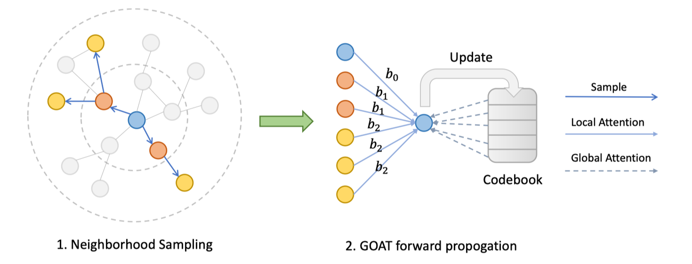

# GOAT: A Global Transformer on Large-scale Graphs

This is the official repository for our paper [GOAT: A Global Transformer on Large-scale Graphs](https://openreview.net/pdf?id=Le2dVIoQun), accepted by ICML 2023.

**TL;DR:** GOAT is a scalable global transformer working on large-scale homophilious & heterophilious graphs with millions of nodes.



## Requirements

To fulfill the environment requirements to reproduce the results of GOAT, run the following script.
```
conda create --name goat python=3.8 --file requirements.txt
conda activate goat
```

## Data downloading

Follow [OGB](https://github.com/snap-stanford/ogb) repo for dataset downloading of `ogbn-arxiv` and `ogbn-products`. Mean-while follow [LINKX](https://github.com/CUAI/Non-Homophily-Large-Scale) repo for `arxiv-year` and `snap-patents`. 

Or you can run the command below for automatic data downloading for the specific dataset:
```
python arxiv_ERM_ns.py \
    --dataset [dataset name] \
    --conv_type local \
    --data_root [ogb data downloading root path] \
    --linkx_data_root [linkx data downloading root path] \
    --data_downloading_flag
```


## Experiments

Below are the command lines to reproduce the experimental results of GOAT.

### Positional encodings

The full GOAT model requires precomputed positional encodings for all of the nodes within the graph. In this work we adopt the `node2vec` algorithm to compute such encodings. Refer to `pos_enc` folder for the script to computation and saving of node2vec encodings for various datasets. Don't forget to modify data loading and encoding saving path to maintain correctness.

### Training GOAT

For the experimental results on dataset `ogbn-arxiv`:

```
python arxiv_ERM_ns.py \
    --dataset ogbn-arxiv \
    --lr 1e-3 \
    --batch_size 1024 \
    --test_batch_size 256 \
    --hidden_dim 128 \
    --test_freq 1 \
    --num_workers 4 \
    --conv_type full \
    --num_heads 4 \
    --num_centroids 4096 \
    --data_root [ogb data downloading root path] \
    --linkx_data_root [linkx data downloading root path]
```
For the experimental results on dataset `ogbn-products`:
```
python arxiv_ERM_ns.py \
    --dataset ogbn-products \
    --lr 1e-3 \
    --batch_size 512 \
    --test_batch_size 256 \
    --hidden_dim 256 \
    --test_freq 5 \
    --num_workers 4 \
    --conv_type full \
    --num_heads 2 \
    --num_centroids 4096 \
    --data_root [ogb data downloading root path] \
    --linkx_data_root [linkx data downloading root path]
```

For the experimental results on dataset `arxiv-year`, you need to mannually specify the `hetero_train_prop` argument. To reproduce results, select one out of [0.1, 0.2, 0.5]:
```
python arxiv_ERM_ns.py \
    --dataset arxiv-year \
    --lr 1e-3 \
    --batch_size 1024 \
    --test_batch_size 256 \
    --hidden_dim 128 \
    --test_freq 5 \
    --num_workers 4 \
    --conv_type full \
    --num_heads 4 \
    --num_centroids 4096 \
    --hetero_train_prop [heterophilious train proportion] \
    --data_root [ogb data downloading root path] \
    --linkx_data_root [linkx data downloading root path]
```

For the experimental results on dataset `snap-patents`, you need to mannually specify the `hetero_train_prop` argument. To reproduce results, select one out of [0.1, 0.2, 0.5]:
```
python arxiv_ERM_ns.py \
    --dataset snap-patents \
    --lr 1e-3 \
    --batch_size 8192 \
    --test_batch_size 8192 \
    --hidden_dim 128 \
    --test_freq 5 \
    --num_workers 4 \
    --conv_type full \
    --num_heads 2 \
    --num_centroids 4096 \
    --hetero_train_prop [heterophilious train proportion] \
    --data_root [ogb data downloading root path] \
    --linkx_data_root [linkx data downloading root path]
```

## Citing GOAT

If you find GOAT useful, please cite our paper.

```
@article{kong2023goat,
  title={GOAT: A Global Transformer on Large-scale Graphs},
  author={Kong, Kezhi and Chen, Jiuhai and Kirchenbauer, John and Ni, Renkun and Bruss, C Bayan and Goldstein, Tom},
  year={2023}
}

```

